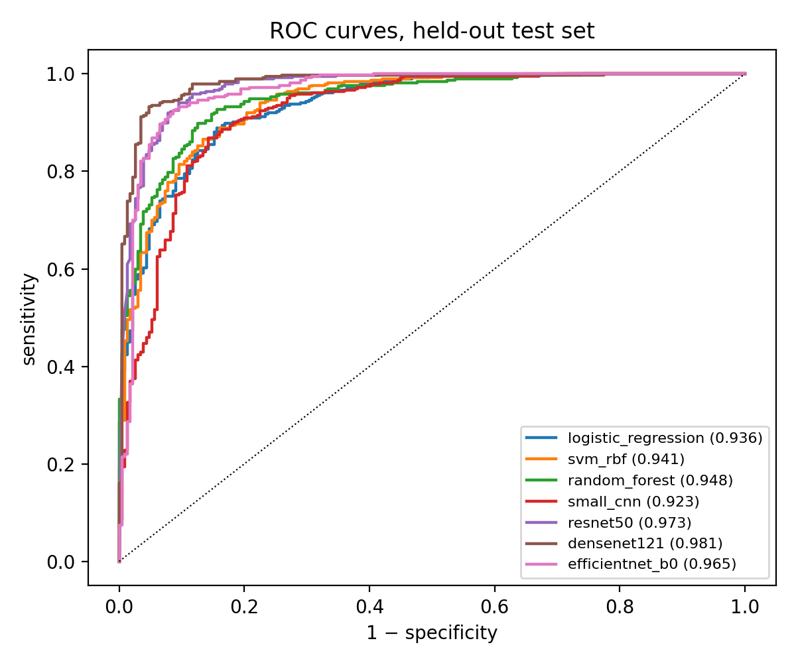
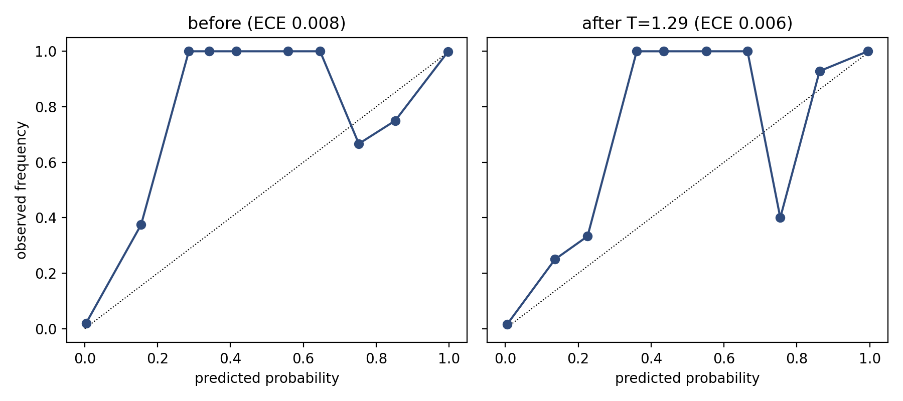
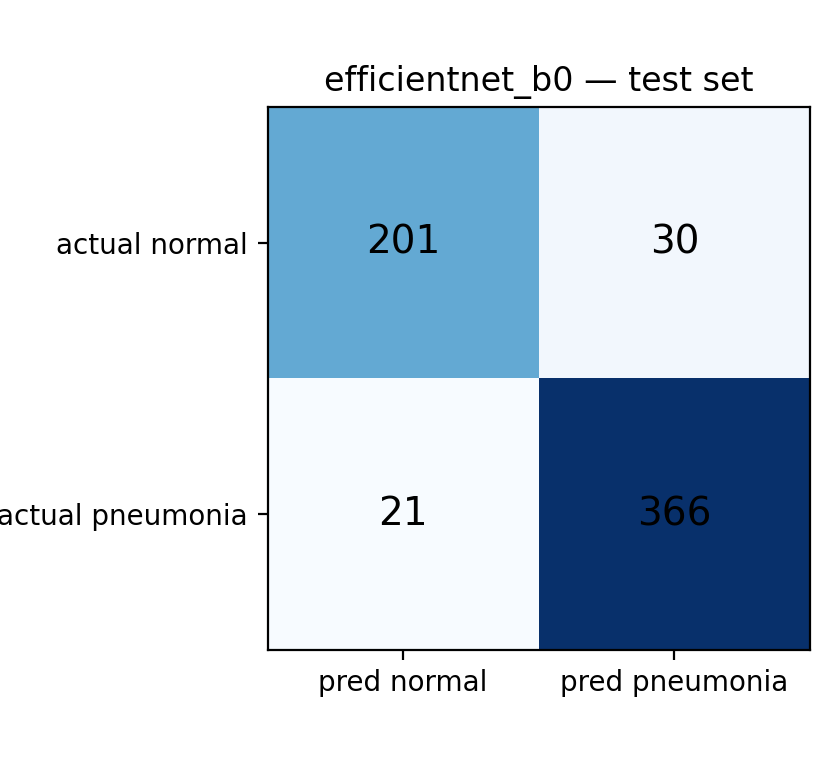
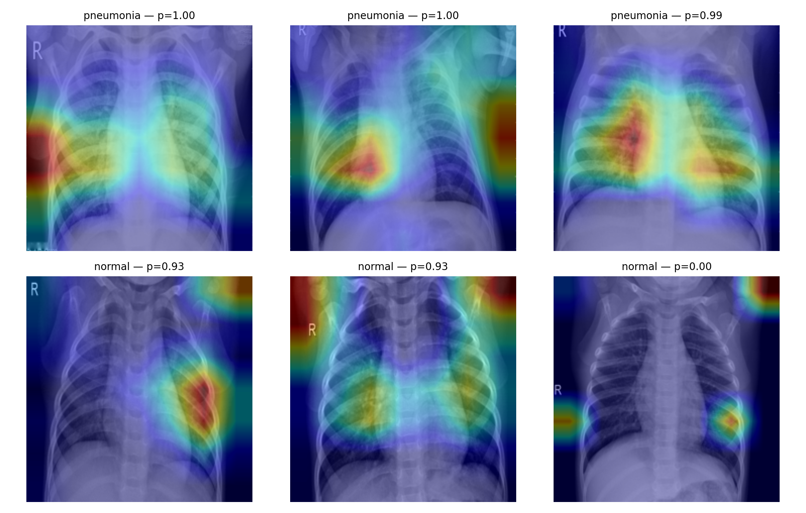
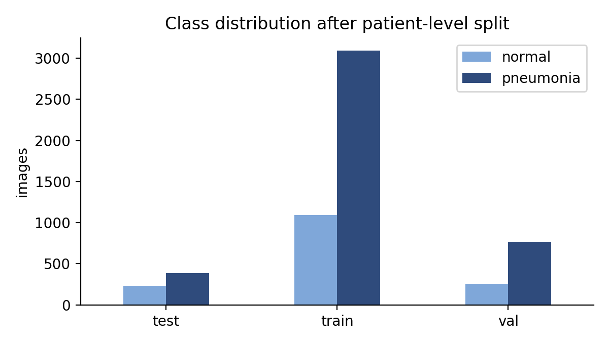
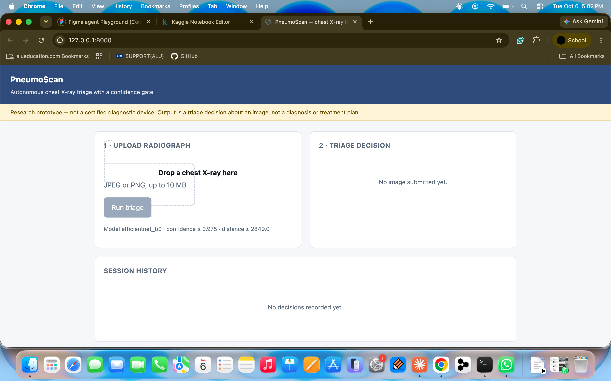
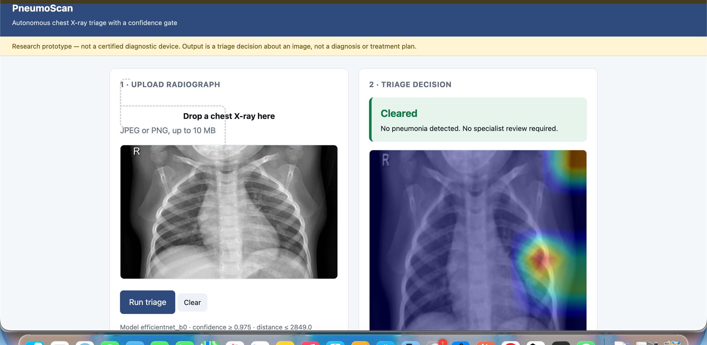
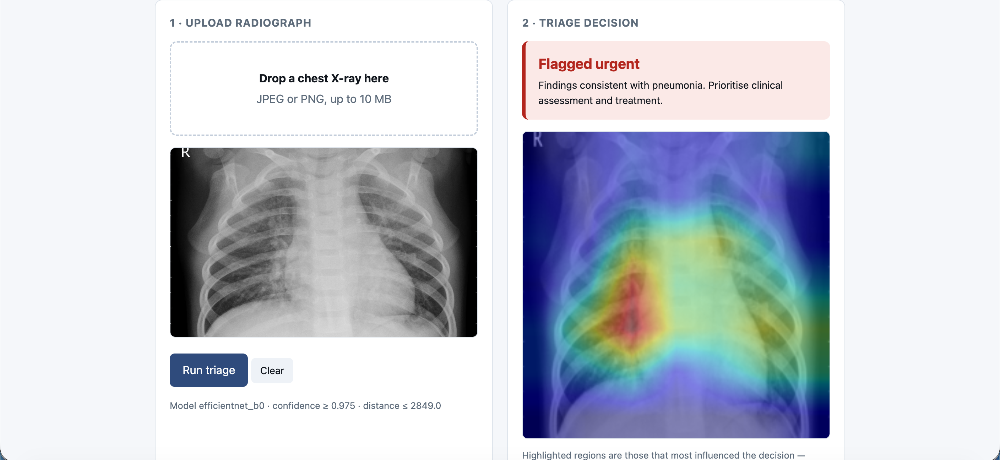
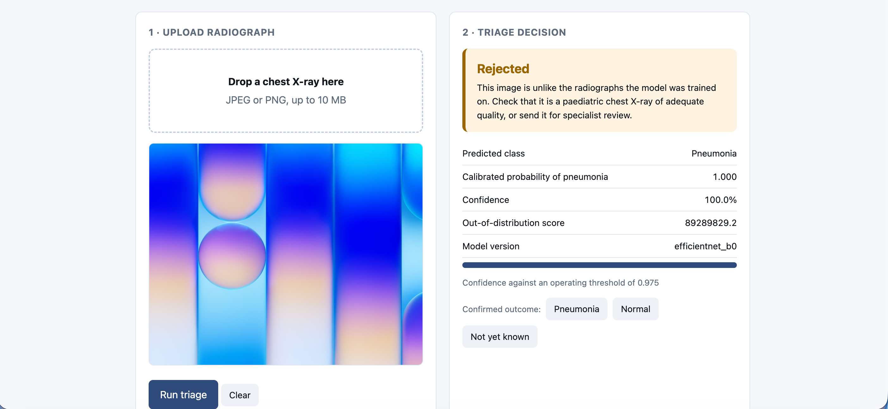
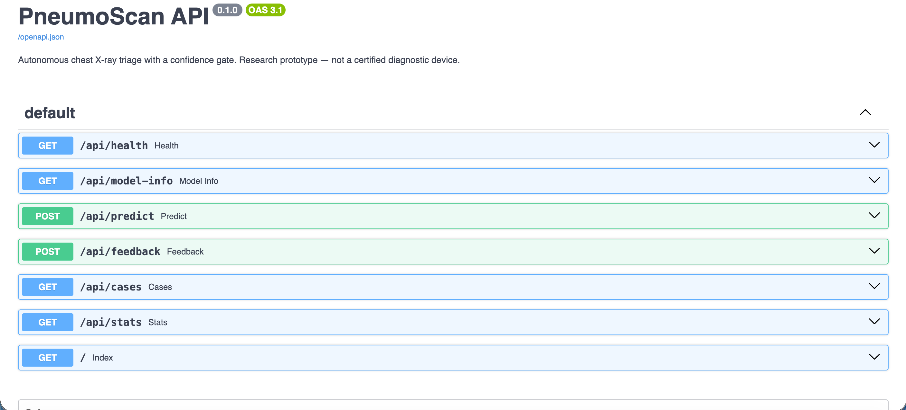

# PneumoScan

Autonomous chest X-ray triage with a confidence gate.

**Repository:** https://github.com/pmugabo/pneumoscan
**Video demo:**
**Figma designs:** https://www.figma.com/design/t6tiMNBoyDIepkTpqvkuKu/Pneumoscan?node-id=7-2&t=GP7jf4vuSEDoHzb9-1
**Author:** Mugabo Patricie 
**Supervisor:** Emmanuel Adjei


## Description

Rwanda has 52 X-ray machines across 56 radiologic facilities but fewer than 20
radiologists for roughly 14 million people. Radiographs are read by
non-specialists or wait days for review.

PneumoScan reads a paediatric chest radiograph and returns a triage decision to
the treating clinician during the same visit, without routing the image through a
radiologist. What separates it from the many pneumonia classifiers built on this
dataset is that **it can refuse to answer**. Before producing any output it checks
two things: whether the image falls inside the distribution the model was trained
on, and whether its calibrated confidence clears the operating threshold.

| State | Meaning |
|---|---|
| `CLEARED` | In distribution, confident, no pneumonia detected. No specialist review needed. |
| `FLAGGED_URGENT` | In distribution, confident, pneumonia detected. Heatmap and report to the clinician. |
| `ESCALATED` | In distribution but confidence below threshold. Route to a specialist. |
| `REJECTED` | Outside the training distribution: wrong view, poor quality, not a paediatric chest X-ray. |

The clinician is not removed from the pathway. The system replaces the
*radiologist as reader*, which is what creates the queue. Examination, treatment
and referral stay with the clinician.

> Research prototype, not a certified medical device.


## What is implemented so far

- [x] Data audit, duplicate detection, **patient-level** train/val split
- [x] Three classical baselines: logistic regression, RBF-SVM, random forest
- [x] Four deep models: small CNN from scratch, ResNet50, DenseNet121, EfficientNetB0
- [x] Temperature scaling for calibration + Mahalanobis out-of-distribution scoring
- [x] Confidence gate with both thresholds fitted on validation only, then frozen
- [x] Grad-CAM explanations on every accepted decision
- [x] FastAPI backend with Swagger UI
- [x] Clinician web interface: upload, triage result, heatmap, outcome feedback, history
- [x] SQLite persistence with an audit log of every decision
- [ ] Out-of-distribution evaluation on adult / degraded / non-chest images
- [ ] PDF report export
- [ ] Usability testing with clinicians


## Initial results

Held-out test set, 618 images (231 normal, 387 pneumonia), never used for training,
model selection or threshold fitting. Split is by patient; 32 duplicate files removed.

| Model | Family | AUC | Sensitivity | Specificity | F1 | Params |
|---|---|---|---|---|---|---|
| DenseNet121 | deep | **0.981** | 0.990 | 0.775 | 0.932 | 6.95M |
| ResNet50 | deep | 0.973 | 0.995 | 0.671 | 0.908 | 23.51M |
| EfficientNetB0 | deep | 0.965 | 0.946 | 0.870 | 0.935 | 4.01M |
| Random forest | classical | 0.948 | 0.928 | 0.836 | 0.916 | n/a |
| SVM (RBF) | classical | 0.941 | 0.959 | 0.736 | 0.906 | n/a |
| Logistic regression | classical | 0.936 | 0.956 | 0.680 | 0.891 | n/a |
| Small CNN (scratch) | deep | 0.923 | 0.982 | 0.571 | 0.878 | 0.24M |

AUC is the comparable column: operating thresholds differ between models (the
selected model uses its calibrated gate threshold, classical models use a
validation-fitted one), so sensitivity and specificity are not like-for-like.
EfficientNetB0 was selected by validation AUC, which was effectively tied across
the three pretrained models (0.9986 to 0.9987) at four decimals. DenseNet121 scores
highest on test AUC, a reminder that near-identical validation scores do not
reliably rank models.

**Confidence gate, EfficientNetB0:**

| | All 618 images | Accepted only (457) |
|---|---|---|
| Sensitivity | 0.946 | **1.000** |
| Specificity | 0.870 | 0.706 |

Autonomy rate **73.9%**: 457 of 618 resolved without escalation, 147 escalated for
low confidence, 14 rejected as out of distribution. The gate buys sensitivity at
the cost of specificity, which is the intended trade in a screening setting: a
missed pneumonia is the dangerous error, an unnecessary review is not.

Not yet measured: gate behaviour on genuinely out-of-distribution inputs (adult,
degraded, non-chest images).

### Charts








## Setup

Tested on macOS with Python 3.9.6 (Apple silicon). Python 3.9 to 3.12 should work.

```bash
git clone https://github.com/pmugabo/pneumoscan.git
cd pneumoscan        # or unzip the submitted archive and cd into it

python3 -m venv .venv
source .venv/bin/activate          # Windows: .venv\Scripts\activate
pip install -r requirements.txt

uvicorn backend.main:app --reload
```

The server prints `[engine] loaded efficientnet_b0 ...` when the model and gate
thresholds have loaded. Stop it with Ctrl+C.

| URL | What |
|---|---|
| http://127.0.0.1:8000 | clinician interface |
| http://127.0.0.1:8000/docs | Swagger UI |
| http://127.0.0.1:8000/openapi.json | OpenAPI schema (import into Postman) |

**Try it:** `samples/` holds four public test radiographs (two normal, two
pneumonia). Upload them in the interface. To see the gate refuse, upload any
photo or screenshot that is not a chest X-ray; it should come back `REJECTED`.

### Model files

The three files the app needs are included in `models/`:

```
models/gate_params.json      selected architecture, temperature, both thresholds
models/gate_stats.npz        class means + precision matrix for Mahalanobis
models/efficientnet_b0.pt    weights (name matches selected_model in gate_params.json)
```

Without them the API starts in **DEMO mode**: the interface works but returns no
clinical output, which is the correct behaviour for a system designed to refuse
rather than guess.


## Training the models

The training notebook is in `notebooks/` and was run on Kaggle's free GPU.

1. Open the notebook on Kaggle (File → Import Notebook).
2. Click **+ Add Input** in the right sidebar and attach the dataset
   `chest-xray-pneumonia` by paultimothymooney.
3. Settings → Accelerator → **GPU T4 x2**, then Run All (roughly 60 minutes).

If Kaggle mounts the dataset at a different path, change `DATA_ROOT` in the first
code cell to the folder that directly contains `train`, `val` and `test`.

Outputs: `model_comparison.csv`, `gating_results.json`, `gate_params.json`,
ROC curves, calibration plot, confusion matrix, Grad-CAM samples. Copies of the
results are in `results/`.


## API

| Method | Endpoint | Purpose |
|---|---|---|
| GET | `/api/health` | service and model status |
| GET | `/api/model-info` | architecture, gate thresholds, triage states |
| POST | `/api/predict` | upload JPEG/PNG → triage decision + heatmap |
| POST | `/api/feedback` | record the confirmed clinical outcome |
| GET | `/api/cases` | decision history |
| GET | `/api/stats` | autonomy rate: share resolved without escalation |

```bash
curl -X POST http://127.0.0.1:8000/api/predict \
  -F "file=@samples/PNEUMONIA_example.jpeg"
```

Example response (values illustrative):

```json
{
  "prediction_id": "6f2a…",
  "state": "FLAGGED_URGENT",
  "label": "Pneumonia",
  "probability": 0.994,
  "confidence": 0.994,
  "ood_score": 1310.8,
  "reason": "Findings consistent with pneumonia. Prioritise clinical assessment and treatment.",
  "heatmap_png": "data:image/png;base64,…",
  "model_version": "efficientnet_b0",
  "thresholds": {"confidence": 0.975, "distance": 2849.0, "temperature": 1.293}
}
```


## Architecture

```
Clinician → Web UI → FastAPI → Inference engine → Confidence gate → triage state
                        ↓              ↓                              ↓
                     SQLite      Grad-CAM (accepted only)       returned to UI
                   (+ audit log)
```

The offline training pipeline exports the model **together with its operating
point** (temperature, confidence threshold, distance threshold), so a model can
never be deployed without the thresholds it was calibrated against.

### Repo layout

```
backend/inference.py   model loading, calibration, Mahalanobis gate, Grad-CAM
backend/main.py        FastAPI endpoints, SQLite persistence, audit log
frontend/index.html    clinician interface (no build step)
notebooks/             training pipeline (Kaggle notebook with saved outputs)
models/                gate parameters, gate statistics and EfficientNetB0 weights
results/               model comparison, gate results, charts
samples/               four public test radiographs for trying the app
docs/                  Figma mockups and screenshots of the running app
```

### Database

`predictions` (prediction_id, filename, created_at, calibrated_prob, ood_score,
triage_state, model_version, confirmed_outcome, comment) and `audit_logs`
(log_id, prediction_id, action, timestamp). SQLite in development, PostgreSQL in
deployment; the schema is identical. The database file is created on first run.


## Deployment plan

**Now: local.** Uvicorn on a laptop, SQLite, CPU inference. Enough for
demonstration and usability testing, and it costs nothing.

**Next: hosted prototype.** Export the model to ONNX, containerise with Docker,
deploy to a free-tier host (Render, Fly.io or Hugging Face Spaces) with PostgreSQL.
This is what remote usability participants would use.

**Later: facility deployment.** The design assumption is that connectivity in a
district hospital cannot be relied on, so inference runs on-device. The
EfficientNetB0 weights are about 16 MB, and the target is a decision in under 5
seconds on CPU (to be measured). Decisions sync when a connection is available.
This stage requires ethics approval, local validation on Rwandan radiographs, and
clinicians shaping the workflow before it is built into one.


## Designs

**Figma file (view only):** https://www.figma.com/design/t6tiMNBoyDIepkTpqvkuKu/Pneumoscan?node-id=7-2&t=GP7jf4vuSEDoHzb9-1

### Interface mockups


### Screenshots of the running app







Diagrams (from the research proposal): system architecture, triage decision logic,
use case, class, ERD, sequence.


## Known limitations

1. Training data is paediatric, from a single hospital in China. Performance on
   Rwandan radiographs is unknown and would need local validation.
2. The gate's out-of-distribution evaluation is not yet run. Thresholds are
   fitted, but adult, degraded and non-chest inputs have not been tested through
   them systematically.
3. Some Grad-CAM heatmaps place weight on image margins rather than the lung
   fields (seen on at least one test image). This is the shortcut-learning risk
   described by Zech et al. (2018). Planned mitigation: crop or mask non-lung
   regions before classification.
4. The gate trades specificity for sensitivity: on accepted cases specificity
   falls from 0.870 to 0.706.
5. No authentication yet. The schema supports roles; login is not implemented.
6. Binary classification only. No bacterial/viral distinction, no lesion
   localisation, no other thoracic disease.

